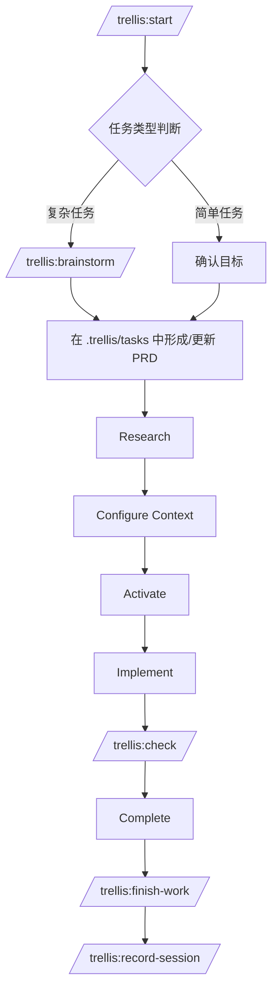
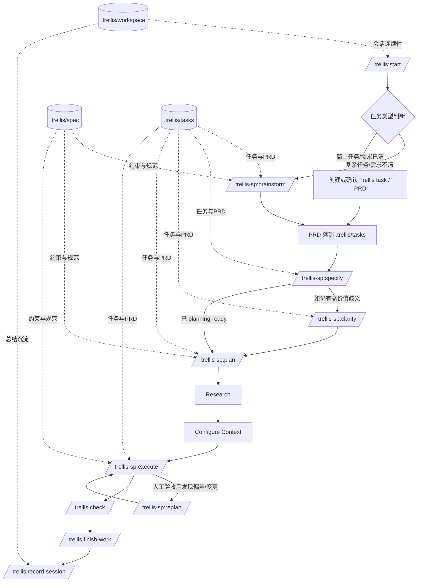

# Superpowers 如何以本地 adapter 方式插入 Trellis

本文聚焦回答五个问题：

1. 这套 adapter 现在到底是什么
2. 它插入 Trellis 的哪些节点
3. 它和原始 Trellis 流程的关系是什么
4. 为什么不再要求安装 Superpowers
5. 应该如何使用和维护它

---

## 1. 先说结论

这套集成**不是**把 Superpowers 写进 Trellis 核心，
也**不是**要求用户先安装 Superpowers 插件再来运行 `/trellis-sp:*` 命令。

现在的实际设计是：

- Trellis 继续做**主工作流框架**
- adapter 在本地内嵌**受 Superpowers 启发的方法论**
- 通过独立命令 namespace `/trellis-sp:*` 插入到 Trellis 的关键节点上
- 所有运行时状态仍然落在 Trellis 自己的 `.trellis/*` 体系里

这意味着：

- **Trellis 管结构、状态和闭环**
- **adapter 管关键节点的方法论增强**
- **Superpowers 只作为方法来源，不再是运行时依赖**

---

## 2. 为什么不能要求用户安装 Superpowers

原因不是“安装麻烦”，而是**运行时冲突**。

在真实项目里，如果本地 Claude Code 安装了 Superpowers，它可能通过 hook 自动加载；而 Trellis 本身也有自己的 hook / workflow 体系。两者叠加后，容易出现：

- 行为重叠
- 生命周期打架
- slash command 预期与实际执行路径不一致
- 调试时难以判断到底是谁接管了当前阶段

所以这个 adapter 现在采取的方向是：

- 不要求用户安装 Superpowers
- 不在运行时调用 `superpowers:*` skills
- 直接把需要的方法论改写进 overlay 命令里

这样保留了 Superpowers 的长处，同时避免 Trellis / Superpowers 的 hook 冲突。

---

## 3. 它是如何插入进去的

### 3.1 插入机制

adapter 不是通过改 Trellis 核心源码插入的，而是通过一个独立 overlay，把额外命令复制到目标 Trellis 项目中。

安装后注入：

- `.claude/commands/trellis-sp/brainstorm.md`
- `.claude/commands/trellis-sp/specify.md`
- `.claude/commands/trellis-sp/clarify.md`
- `.claude/commands/trellis-sp/plan.md`
- `.claude/commands/trellis-sp/execute.md`
- `.claude/commands/trellis-sp/replan.md`
- `.claude/skills/trellis-sp-local/SKILL.md`

这些文件来自：

- `trellis-superpowers-adapter/overlay/.claude/commands/trellis-sp/brainstorm.md`
- `trellis-superpowers-adapter/overlay/.claude/commands/trellis-sp/specify.md`
- `trellis-superpowers-adapter/overlay/.claude/commands/trellis-sp/clarify.md`
- `trellis-superpowers-adapter/overlay/.claude/commands/trellis-sp/plan.md`
- `trellis-superpowers-adapter/overlay/.claude/commands/trellis-sp/execute.md`
- `trellis-superpowers-adapter/overlay/.claude/commands/trellis-sp/replan.md`
- `trellis-superpowers-adapter/overlay/.claude/skills/trellis-sp-local/SKILL.md`

安装入口仍然是：

- `trellis-superpowers-adapter/install.sh`
- `trellis-superpowers-adapter/bootstrap.sh`
- `trellis-superpowers-adapter/manage.sh`

### 3.2 为什么这样插

这样做有几个明确目的：

1. **不改 Trellis core**
   - 不修改 `packages/cli/*`
   - 不修改 Trellis 自带 `.claude/commands/trellis/*`

2. **不接管 Trellis 默认 hooks**
   - 不修改 `.claude/settings.json`
   - 不把额外行为塞到默认 `SessionStart`

3. **命令命名空间隔离**
   - Trellis 原生命令：`/trellis:*`
   - adapter 增强命令：`/trellis-sp:*`

4. **保留 Trellis 为唯一 source of truth**
   - `.trellis/tasks/`
   - `.trellis/spec/`
   - `.trellis/workspace/`

---

## 4. 它增强了哪些节点

### 4.1 节点总览

| 节点 | Trellis 原始职责 | 现在的增强方式 | 命令 | 运行方式 |
|---|---|---|---|---|
| Brainstorm | 澄清需求、形成 PRD | 用本地内嵌的 brainstorming discipline 增强需求发现与问题收敛 | `/trellis-sp:brainstorm` | 无需外部 skill |
| Specify | 将需求收束成结构化 task spec | 用 Trellis-native spec authoring 把需求整理进 active task `prd.md` | `/trellis-sp:specify` | Trellis-native |
| Clarify | 在实现前消除高价值歧义 | 用 Trellis-native clarification 流程回写 active task `prd.md` | `/trellis-sp:clarify` | Trellis-native |
| Plan | 把需求转成可执行计划 | 用本地内嵌 planning discipline 在需要时拆成原子子任务，并生成 parent/child task-local execution contract | `/trellis-sp:plan` | 无需外部 skill |
| Execute | 推进实现与校验 | 用本地内嵌 execution discipline 按原子子任务渐进执行，并把真实工作路由给 Trellis subagents | `/trellis-sp:execute` | 无需外部 skill |
| Replan | 人工验收后处理实现偏差或需求变更 | 在原 parent task 上归类反馈、更新 PRD/计划增量，并把流程安全送回 execution | `/trellis-sp:replan` | 无需外部 skill |

### 4.2 明确没有插入的节点

以下部分仍然完全由 Trellis 原生负责：

- `/trellis:start`
- `.trellis/spec/`
- `.trellis/tasks/`
- `.trellis/workspace/`
- Trellis 默认 hooks / context injection
- `/trellis:check`
- `/trellis:finish-work`
- `/trellis:record-session`

也就是说，这套 adapter 只增强：

- Brainstorm
- Specify
- Clarify
- Plan
- Execute
- Replan

它**不接管** Trellis 的系统骨架。

---

## 5. Trellis 原始流程与插入后的流程

### 5.1 Trellis 原始流程



原始流程的特点：

- Trellis 以 `.trellis/` 为核心工作区
- 任务以 PRD 和 task 目录为中心
- Research / Configure Context / Implement / Check 是主链路
- Check、Finish-work、Record-session 构成质量闭环

### 5.2 插入 adapter 后的总流程



### 5.3 如何理解这张图

- `trellis:start` 仍然是总入口
- 原生 `trellis:brainstorm` 仍然保留；adapter lane 只是在选择 `/trellis-sp:brainstorm` 后进入的增强路径，不替代 Trellis 原生 brainstorm
- `trellis-sp:brainstorm` 增强需求澄清节点，并应确保 parent task 被设为 current task，避免下一步 `specify` 丢失上下文；同时它现在还应在提问前先完成一次 requirement normalization，把 raw source 解析成 parent `normalize.md`，并把 deferred / excluded / conflicting / pending / blocked 项记入 `memorandum.md`
- `trellis-sp:specify` 增强任务规格整理节点，不再把 raw source 当作主要 formalization 输入，而是以 `normalize.md` 为主来生成 reviewed `prd.md`，同时参考 `memorandum.md` 过滤未承诺项；其中前端显式点名的 UI 控件/组件必须按原语义保留
- `trellis-sp:clarify` 增强歧义收敛节点，并在需要时刷新书面 `Spec Review Gate`
- `trellis-sp:plan` 在需要 staged delivery 时把计划拆成原子子任务，并收敛成 parent/child task-local execution contract；planning 期间 current task 仍保持 parent，同时新增 parent `trace.md` 作为需求到 proof 的追踪脊柱
- `trellis-sp:execute` 按原子子任务增强执行节点，但真实工作仍回到 Trellis-compatible subagent；执行 child 时切到 child，先做 spec-compliance review，再做更广义的 code-quality / `check`，最终校验前再切回 parent
- `trellis-sp:replan` 是执行后的人审反馈处理入口：它继续复用原 parent task，对“实现偏差 / 需求变更 / 混合情况”做归类，更新 `prd.md` / `trace.md` / delta handling plan，再回到 `execute`
- `trellis:check`、`finish-work`、`record-session` 继续构成 Trellis 原生闭环，其中 `finish-work` 只能在 parent-level final `check` 之后触发
- child task 只是 staged execution unit，不应被单独视为 ready-for-finish-work；只有 parent task 才能进入 Trellis-native finish handoff
- handoff 到 `finish-work` 之前，应显式判断是否需要通过 `/trellis:update-spec` 回灌这次流程中发现的通用规则、约束或调试经验
- `finish-work` 之后，如果这次 staged execution 形成了值得跨 session 复用的结论，应继续通过 `/trellis:record-session` 保存

所以它表达的是：

**Trellis 骨架 + 本地内嵌的方法论增强节点**

而不是：

**Trellis 运行时依赖 Superpowers 插件**

---

## 6. 六个增强节点分别是什么含义

### 6.1 Brainstorm

原始 Trellis：
- 复杂任务走 `/trellis:brainstorm`
- 重点是澄清需求、生成 PRD

插入后：
- 使用 `/trellis-sp:brainstorm`
- 在本地应用受 Superpowers 启发的 brainstorming discipline
- 但结果仍然落回 `.trellis/tasks/` 和 active task `prd.md`
- 如果原本没有 active task，就先创建 parent task，并立即把 `.trellis/.current-task` 指向它，再继续进入 `specify`
- 创建 parent task 或发现 parent adapter 标记缺失/过期时，应立即执行 `python3 .claude/scripts/trellis-sp-task-meta.py <task-dir> --role parent --phase brainstorm`

也就是说：
- **增强的是思考过程**
- **不改变 Trellis 的任务归档位置**

### 6.2 Specify

原始 Trellis：
- Brainstorm 之后的 PRD 仍可能偏粗粒度
- 缺少 spec-kit 风格的结构化任务 spec 整理步骤

插入后：
- 通常在 `/trellis-sp:brainstorm` 之后先使用 `/trellis-sp:specify`
- 把需求收束到 active task `prd.md`
- 强化 User Scenarios、Requirements、Success Criteria、Assumptions、Out of Scope
- `/trellis-sp:specify` 结束前，应立即执行 `python3 .claude/scripts/trellis-sp-task-meta.py <task-dir> --role parent --phase specify`
- 当 PRD 已经 planning-ready 时可直接进入 `/trellis-sp:plan`，否则必要时再进入 `/trellis-sp:clarify`
- 不创建 `specs/` 或 `.specify/` 工作区

### 6.3 Clarify

原始 Trellis：
- 对 PRD 的进一步澄清更多依赖自由对话
- 缺少系统化 ambiguity taxonomy

插入后：
- 使用 `/trellis-sp:clarify`
- 在本地复用 spec-kit 风格的高价值歧义扫描和逐题澄清
- 每次回答后直接回写 active task `prd.md`
- 不创建 task 外的澄清状态

### 6.4 Plan

原始 Trellis：
- PRD 明确后，进入 research / context / implementation 主链
- 计划更多是隐式存在

插入后：
- 显式加入 `/trellis-sp:plan`
- 在本地应用受 Superpowers 启发的 planning discipline
- 当任务过大、不适合单次 reviewable pass 时，会先拆成原子子任务
- planning 期间 `.trellis/.current-task` 仍保持 parent task，不因为创建 child task 而永久切走
- planning 进行时，应立即执行 `python3 .claude/scripts/trellis-sp-task-meta.py <parent-task-dir> --role parent --phase plan`；当 parent 准备进入 execution handoff 时，应保持 `last_phase="plan"` 的真实语义，并额外记录 `resume_source=plan`，而不是提前写成 `execute`
- 如果 parent 缺失 `implement.jsonl` / `check.jsonl` / `debug.jsonl`，应先执行 `python3 ./.trellis/scripts/task.py init-context <parent-task-dir> <dev_type>` 初始化父任务上下文，再用 `python3 ./.trellis/scripts/task.py add-context ...` 仅补齐 Trellis-native preload context，例如相关 spec、共享 guides/docs，以及确有必要时极少量可复用 code-pattern reference；likely touched 的业务代码文件应写入 `info.md`，而不是通过 jsonl 预载
- 每个新建或更新的 child task，如缺失 jsonl，也应先执行 `python3 ./.trellis/scripts/task.py init-context <child-task-dir> <dev_type>`，再立即执行 `python3 .claude/scripts/trellis-sp-task-meta.py <child-task-dir> --role child --phase execute --clear-resume`；同时 child `info.md` 应显式记录 `Read First`、likely touched files、实现顺序与验证目标，供运行时按需读取代码
- 输出的是 parent/child task-local implementation contract，而不是外部 plan workspace
- 产物收敛到：
  - parent task `prd.md`
  - parent task `info.md`
  - parent `implement.jsonl`
  - parent `check.jsonl`
  - parent `debug.jsonl`
  - 必要时新增 child tasks 及其各自的 `prd.md` / `info.md` / jsonl context files
- 其中 jsonl 只承载 Trellis-native preload context；真实业务代码的运行时读取目标记录在 parent/child `info.md`

### 6.5 Execute

原始 Trellis：
- 进入 implement / check

插入后：
- 使用 `/trellis-sp:execute`
- 在本地应用受 Superpowers 启发的 execution discipline
- 如果计划阶段已经拆出原子子任务，则按 child task 顺序渐进执行，而不是把整个任务当作一次性 implementation pass
- 执行每个 child task 前，先把 `.trellis/.current-task` 切到该 child；对 `task.json.status` 已是 `completed` 或 `done` 的 child 默认跳过；若存在 `resume_child`，则优先从该待执行 child 恢复；所有 child 完成后，再切回 parent task 做最终校验
- 真实执行并不交给外部 plugin，而是路由到 Trellis-compatible subagent：
  - `research`
  - `implement`
  - `check`
  - `debug`
- 每个 child task 完成后都要经过 review checkpoint
- 所有 child task 结束后，最终验证必须显式回到 parent-level Trellis `check`

### 6.6 Replan：当人工验收发现实现偏差或需求变更

如果 parent task 已经走完一轮 `/trellis-sp:execute`，后来人工验收发现：

- 做出来的效果不是最初想要的
- 或者需求本身发生了变化
- 或者两者同时存在

此时不应该简单地把已经完成的 child task 改写成另一件事，也不应该新开一个平行 parent task。更合适的做法是：

1. 进入 `/trellis-sp:replan`
2. 继续复用原 parent task 作为唯一 source of truth
3. 先判断属于：
   - 实现偏差
   - 需求变更
   - 混合情况
4. 仅在需求变更时回写 parent `prd.md`
5. 在 parent `info.md` 中追加一段 delta handling plan
6. 如果这轮返工已经形成新的 reviewable work unit，就新增 follow-up child task，而不是重写已完成 child task
7. 再回到 `/trellis-sp:execute`，按正常 Trellis-compatible execution/checkpoint/final-check 流程完成修正；replan 完成后 parent 应停留在真实的 `last_phase=replan` 状态，直到 corrective execute 真正开始

这个节点的本质不是 reopen 一个新工作流，而是：

- 保留第一轮执行历史
- 把第二轮人审反馈变成可执行的增量计划
- 继续遵守 parent final `check` → `finish-work` 的 Trellis 闭环

---

## 6.7 一个原子子任务执行示例

假设当前 active Trellis task 是一个 parent task：

- `为 adapter 增加 atomic workflow`

如果这个任务已经 planning-ready，但明显跨越多个 reviewable work units，那么 `/trellis-sp:plan` 不应只留下一个泛泛的 `info.md`，而应该把它拆成类似下面的 child tasks：

1. `update plan command contract`
2. `update execute command contract`
3. `update adapter verification and docs`

每个 child task 都应该：
- 有自己收窄后的 `prd.md`
- 有自己的 `info.md`
- 有自己的 `implement.jsonl` / `check.jsonl` / `debug.jsonl`
- 有明确的 likely touched files 与 verification target
- 把 `Read First`、likely touched files、实现顺序与验证目标写入 `info.md`，而不是把业务代码文件直接塞进 jsonl

随后 `/trellis-sp:execute` 的理想推进方式是：

1. 先执行 child 1
   - `implement`
   - `check`
   - 如有问题则 `debug`
   - 再次 `check`
   - 到达 review checkpoint 后再继续
2. 再执行 child 2
3. 再执行 child 3
4. 所有 child 完成后，对 parent task 做一次 final `check`

这里最关键的不是“创建了几个目录”，而是：
- child task 成为真正的执行单位
- review/checkpoint 发生在 child task 粒度
- parent task 负责总需求和总体验证

因此，adapter 借用的是 Superpowers 的拆分与节奏控制方法，但真正的执行单元、上下文注入、检查闭环仍然落在 Trellis task system 上。

## 7. 如何使用

### 7.1 第一次接入

推荐直接用 bootstrap：

```bash
cd trellis-superpowers-adapter
./bootstrap.sh /path/to/your/trellis-project
```

或者：

```bash
./manage.sh bootstrap /path/to/your/trellis-project
```

完成后建议执行：

```bash
./manage.sh status /path/to/your/trellis-project
./manage.sh self-test /path/to/your/trellis-project
```

### 7.2 日常使用流程

#### 场景 A：复杂任务 / 需求不明确

```text
/trellis:start
/trellis-sp:brainstorm
/trellis-sp:specify
(/trellis-sp:clarify 如有需要)
/trellis-sp:plan
/trellis-sp:execute
/trellis:check
/trellis:finish-work
/trellis:record-session
```

#### 场景 B：需求已经清楚

```text
/trellis:start
/trellis-sp:specify
/trellis-sp:plan
/trellis-sp:execute
/trellis:check
/trellis:finish-work
```

#### 场景 C：父任务执行后，人工验收发现偏差或需求变更

```text
/trellis-sp:replan
/trellis-sp:execute
/trellis:check
/trellis:finish-work
```

这里的 `/trellis-sp:replan` 应继续复用原 parent task：
- 仅在需求变更时回写 parent `prd.md`
- 在 parent `info.md` 中写 delta handling plan
- 需要 reviewable staged fix 时优先新增 follow-up child task

#### 场景 D：特别小的修复

对于真正 trivial 的改动，也可以完全不走这套增强命令，直接走 Trellis 原生流程。

---

## 8. 运行时约束

- task-level feature spec 的唯一事实来源是 active task `prd.md`
- `/trellis-sp:plan` 不会把 plan 默认落到外部 `docs/superpowers/plans/...`，而是在需要时拆成原子子任务，并准备 Trellis parent/child task-local execution contract；jsonl 仅承载 Trellis-native preload context，运行时代码读取指引写入 `info.md`
- `/trellis-sp:execute` 不把 Superpowers 当作直接执行引擎，而是按子任务顺序推进，并把真正的实现/检查/调试路由到 Trellis-compatible subagent；执行 child task 时应先审阅 child/parent 的 `prd.md` 与 `info.md`，再按 `Read First` 和 likely touched files 在运行时读取代码
- `/trellis:start` 在 current-task 与 manual-selection 两种恢复入口下，都应先读 `task.json.meta.trellis_sp` 再分流：parent task 恢复时读取 parent `prd.md` 与 `info.md`；child task 恢复时读取 child `prd.md`、parent `prd.md`、parent `info.md`，先完成当前 child loop，再回到 parent final `check`
- 运行时用于识别任务身份的 metadata 位于 `task.json.meta.trellis_sp`；推荐字段为 `managed`、`role`、`workflow_version`、`last_phase`、`resume_source`、`resume_child`，并由 `.claude/scripts/trellis-sp-task-meta.py` 负责写入与刷新
- 当前 adapter **不会**把执行阶段直接托管给 Trellis `dispatch` agent。原因是：dispatch 代表的是更完整的 Trellis pipeline orchestration，不只是调用 implement/check，还会进一步依赖 `task.json.next_action`、finish/create-pr 等更深层的 phase 语义。对于 adapter 来说，现在先保持“执行桥接层”定位更稳：既能复用 Trellis subagent、hook 注入和 Ralph Loop，又不会过早把 adapter 和完整 dispatch pipeline 绑定在一起。
- `/trellis-sp:replan` 不会新开一条平行父任务工作流；它只是在同一个 parent task 上，把人审反馈转成 delta handling plan，再回到正常的 adapter execution 闭环。
- `research` 在文档语义上仍然是 Trellis 标准 planning 步骤，但运行时采用按需触发：context 足够时可跳过，context 缺失时必须补齐
- Ralph Loop 只有在路线真正进入 Trellis `check` subagent 时才会重新生效，因此最终验证必须收口到 Trellis `check`
- 这套 adapter 的存在目的之一，就是避免用户因为安装 Superpowers 而引入 hook 自动加载冲突

---

## 9. 最后总结

可以把这套方案理解成：

- **Trellis = 主框架 / 骨架 / source of truth / 执行底座**
- **adapter = 在 Brainstorm / Plan / Execute 节点上内嵌受 Superpowers 启发的方法论增强层**

所以最终结果不是“让 Trellis 依赖 Superpowers 插件”，而是：

> **在不引入运行时冲突的前提下，把 Superpowers 的思考与执行方法安全地吸收到 Trellis 流程里。**
